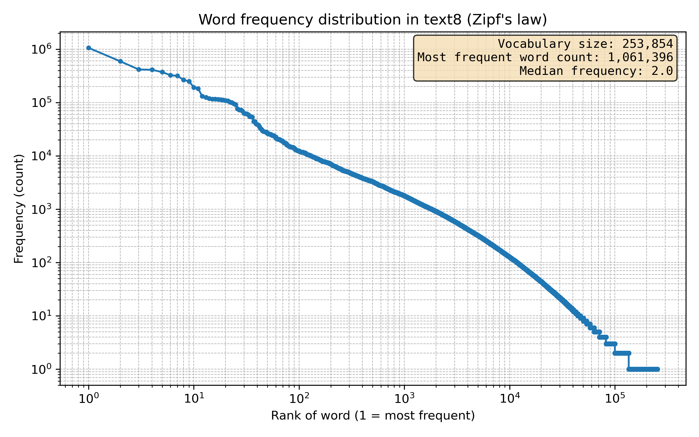
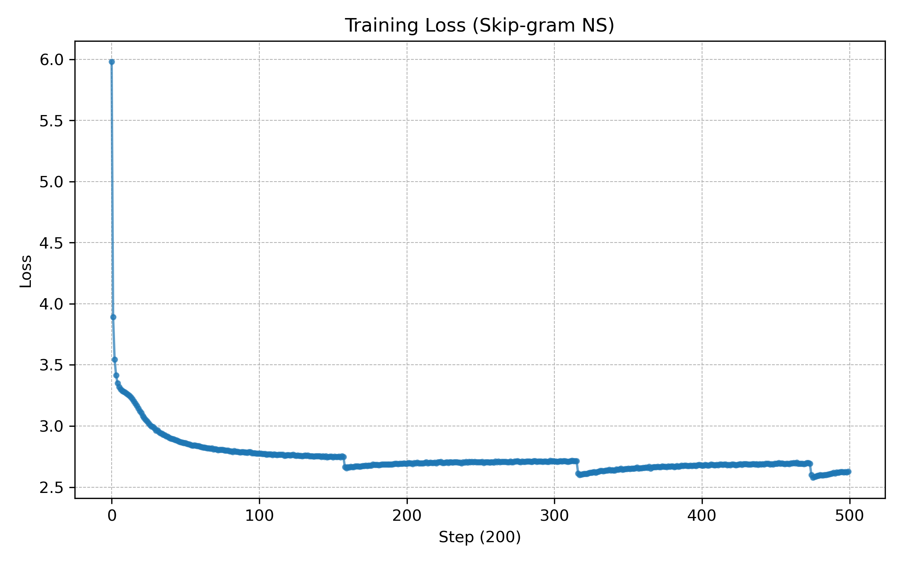

# Word2Vec-paper
A reimplementation of the paper "Efficient Estimation of Word Representations in Vector Space" from 2013. 

https://arxiv.org/pdf/1301.3781 
Dataset used: text8 from https://www.kaggle.com/datasets/yorkyong/text8-zip

reading notes with intuition and explanations behind the methods used lay in docs/reading_notes.md

## Word counts

## Results Skip-Gram
- K (num_negatives) = 10
- steps 100k (6-7 hrs on cpu macbook pro m3)
- lr (adam) = 0.002
- max_window = 5
- batch_size = 1024
- Vocab size (after min_count): 47134

### Assosiations - 10 closest vectors (semantic):
- king → ['kings', 'montferrat', 'vii', 'throne', 'crowned', 'iii', 'succeeded', 'conqueror', 'reigned','queen']
- paris → ['seine', 'montparnasse', 'france', 'cimeti', 'lachaise', 'eug', 'bruxelles', 'moderne', 'libert', 'sainte']
- computer → ['computing', 'computers', 'hardware', 'software', 'microcomputer', 'interfaces', 'interface', 'devices', 'graphics', 'calculator']
- car → ['cars', 'automobile', 'mercedes', 'racing', 'acura', 'driver', 'auto', 'truck', 'peugeot', 'racer']
- bike → ['bicycle', 'bikes', 'motocross', 'biking', 'motorcycle', 'bicycles', 'bicyclists', 'motorized', 'cycling', 'racing']
- motivation → ['thoughts', 'disregard', 'coercion', 'topic', 'inconsistency', 'focuses', 'moral', 'evaluation', 'consequences', 'honesty']
- love → ['girl', 'kisses', 'baby', 'girls', 'kiss', 'passionate', 'songs', 'song', 'my', 'album']
- norway → ['denmark', 'sweden', 'iceland', 'norwegian', 'netherlands', 'olav', 'kalmar', 'swedish', 'gustaf', 'switzerland']
- city → ['town', 'cities', 'metropolitan', 'urban', 'suburbs', 'located', 'towns', 'downtown', 'village', 'situated']
- big → ['bang', 'scooby', 'boogie', 'lebowski', 'bb', 'dicke', 'uh', 'wanna', 'maybe', 'bubbles']
small → ['smaller', 'large', 'larger', 'dense', 'well', 'especially', 'size', 'sized', 'very', 'amounts']

### Analogies (syntactic):
- kings - king + queen → ['regnant', 'monarch', 'tanistry', 'glastonbury', 'monarchs'] (FAIL)
- smaller - small + big → ['boogie', 'bang', 'bb', 'reggaeton', 'feelgood'] (FAIL)
- cars - car + truck → ['trucks', 'vans', 'vehicles', 'hearses', 'tractors'] (CORRECT)
- bikes - bike + town → ['city', 'borough', 'wealthy', 'dundas', 'norwich'] (FAIL)

Note: word level tokenization in addition to text8 dataset being small weaken morphology (Morphology is the study of how words are formed from smaller meaningful pieces (morphemes).)

### Training loss

